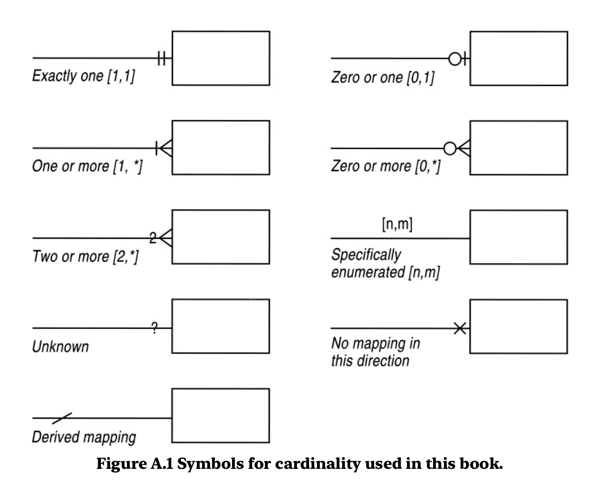
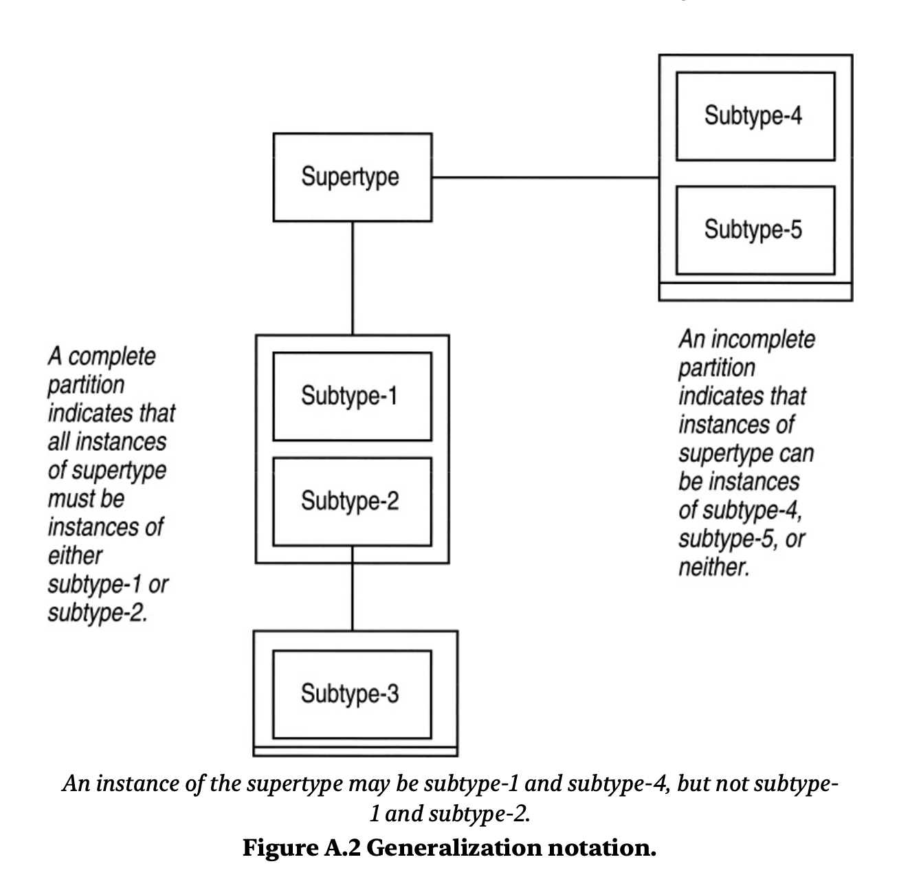
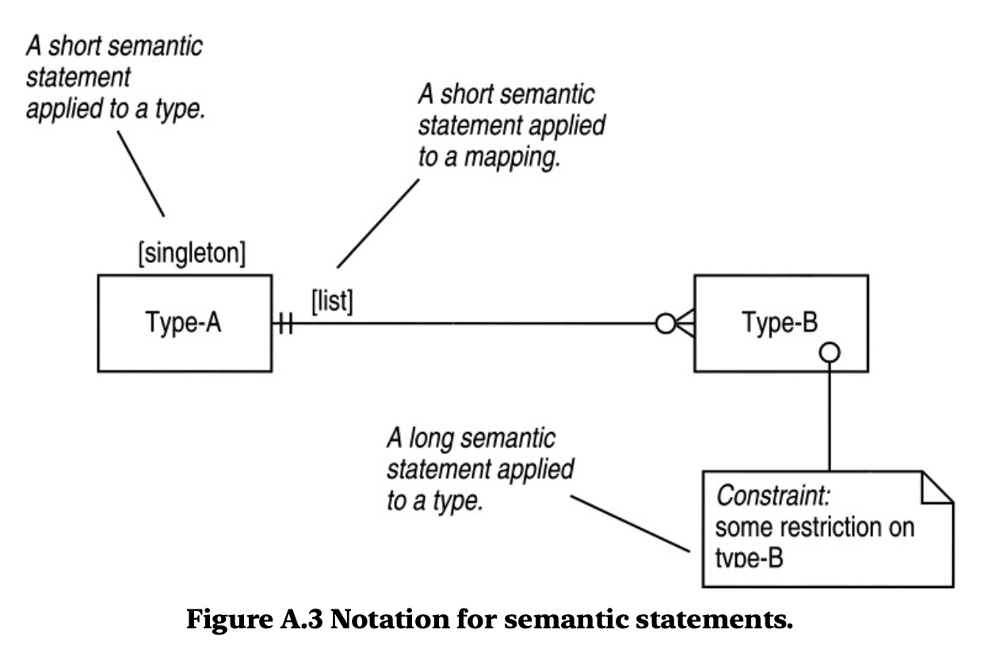

# 建模图编辑器 - 产品需求文档 (PRD)

## 1. 概述
基于Web的协作式建模图编辑器，使用Martin Fowler在《分析模式》一书中采用的符号体系（该符号体系源自James Martin和James Odell的《面向对象方法：基础》）。该工具支持实时多作者协作、多种格式导出，并可部署在Linux机器或Docker容器中。

## 2. 目标用户
- 软件架构师和设计师
- 业务分析师
- 系统建模师
- 需要协作进行系统设计的团队
- 面向对象分析的教育者和学生

## 3. 核心需求

### 3.1 图表编辑
- **符号支持**：全面支持Martin Fowler《分析模式》附录A "Type Diagrams"中的符号体系：
  - **type表示**：矩形方块，表示建模中的类型（注意：Martin Fowler的notation中只有type，没有class和interface的概念）。type内部只需要名称，不需要属性和操作等细节。
  - **基数表示法（Cardinality）**：基于Crow's Foot Notation（乌鸦脚表示法）的变体，用于描述type之间的关系基数。type之间的连线均为实线，基数符号出现在连线末端作为箭头的变体：
  
    * **Exactly one $[1, 1]$（必须且仅有一个）**：线条末端画两条垂直短并行线（||）
    * **Zero or one $[0, 1]$（零个或一个）**：线条末端画圆圈紧接着垂直短线（○|）
    * **One or more $[1, *]$（一个或多个）**：线条末端先画垂直短线，再分叉成三条线（乌鸦脚）
    * **Zero or more $[0, *]$（零个或多个）**：线条末端先画圆圈，再分叉成三条线（乌鸦脚）
    * **Two or more $[2, *]$（两个或更多）**：类似"一个或多个"，但在乌鸦脚上方标注数字"2"
    * **Specifically enumerated $[n, m]$（指定范围）**：线条上方直接写区间符号$[n, m]$
    * **Unknown（未知）**：线条末端画问号"?"
    * **No mapping in this direction（此方向无映射）**：线条末端画叉号"X"
    * **Derived mapping（派生映射）**：线条上画倾斜撇号"/"表示推导关系
  - **Type Generalization（类型泛化）**：通过嵌套方框表示父类（Supertype）与子类（Subtype）之间的逻辑关系：
  
    * **核心布局**：
      - 父类（Supertype）：顶部或中心的独立矩形框
      - 子类组合（Subtype Boxes）：通过直线连接到父类，嵌套在一个或多个外部容器框中
    * **划分类型**：
      - **完整划分（Complete Partition）**：容器框底部有两条平行水平线（厚底座），表示"穷尽且互斥"，父类的所有实例必须属于其中某一个子类
      - **不完整划分（Incomplete Partition）**：容器框底部只有单条水平线，表示"非穷尽"，允许存在未定义的子类型
    * **特殊规则**：
      - **多重划分（Multiple Partitions）**：父类可同时连接多个容器框（完整划分和不完整划分可共存）
      - **正交性（Orthogonality）**：实例可同时属于不同划分的子类，但不能同时属于同一划分内的不同子类
      - **多层泛化（Multi-level）**：子类可进一步细分，形成递归的树状或网状结构
    * **语义总结**：
      - 双底线方框 = 完整划分（所有实例必须入座）
      - 单底线方框 = 不完整划分（允许存在定义之外的实例）
      - 同一框内的子类 = 互斥（不可兼得）
      - 不同框的子类 = 可叠加（一个实例可拥有多种分类标签）
  - **语义陈述（Semantic Statements）**：在复杂的领域建模中，图形符号负责骨架，而语义陈述负责赋予灵魂和规则：
  
    * **短语义陈述（Short Semantic Statements）**：使用方括号 [marker] 标注在类型框顶部或关系线上：
      - **核心约束类**：
        * [abstract]：附于类型 - 该类型不能有直接实例，必须通过子类实例化；附于映射 - 表示该关系是抽象的，必须由子域的具体实现来覆盖
        * [immutable] 或 [imm]：附于映射 - 关系一旦建立，不可更改；附于划分 - 静态子类型，对象在该划分内不能改变类型
        * [singleton]：附于类型，表示该类在全局只能有一个实例
      - **关系与集合类**：
        * [list]：附于多值映射，表示返回的是一个有序集合
        * [class]：附于映射，表示该关系属于"类"本身（类似静态成员），而非属于某个具体实例
        * [key: a type]：附于映射，表示这是一个限定映射（Keyed Mapping）
        * [n1, n2]：直接定义映射的上下界
      - **结构与层次类**：
        * [hierarchy]：附于递归关联 - 对象间形成树状层次结构；附于多值映射 - 返回的是一个层次结构对象
        * [Dag]：附于递归关联/映射 - 形成有向无环图（Directed Acyclic Graph），允许有多个父节点但不能成环
        * [multiple hierarchies]：附于递归关联，表示存在多个并行的层次结构
        * [historic]：附于历史映射，表示需要维护连接的历史痕迹
        * [global]：附于包（Package），表示该包对所有其他包可见
    * **长语义陈述（Long Semantic Statements）**：当规则无法用一个单词概括时，使用"折角便签"符号，根据以下标题开头：
      
      | 标题 (Heading) | 作用对象 (Attached To) | 语义含义 |
      |--------|----------|--------|
      | Constraint | 类型 (Type) | 必须对该类型所有实例都为真的断言（业务规则） |
      | Derivation | 派生映射 | 描述该映射是如何计算出来的逻辑（实现时可替换） |
      | Instances | 类型 (Type) | 枚举出该类型允许的所有合法实例列表 |
      | Method | 操作 (Operation) | 详细描述某个操作的具体实现算法 |
      | Note | 任何对象 | 非正式的、描述性的注释 |
      | Overload | 类型 (Type) | 说明该类型如何重写（Overload）父类的某些特性 |

- **绘图工具**：
  - 拖放形状创建
  - 关系连接工具
  - 文本标注工具
  - 对齐和分布辅助工具
  - 网格和吸附到网格
  - 缩放和平移
- **图表管理**：
  - 文件操作：新建、保存、另存为图表文件
  - 撤销/重做历史记录

### 3.2 导出能力
- **元数据导出**：JSON/XML格式，保留图表结构、元素和关系
- **图像导出**：SVG（矢量）、PNG、PDF
- **代码生成**：可选导出为编程语言骨架（未来增强）
- **打印支持**：高质量打印，支持页面布局选项

### 3.3 实时协作
- 简化协作功能：任何人打开链接即可编辑图表
- 每个会话分配内部随机名称，显示在页面上以便识别当前编辑者
- 支持多人同时编辑，实时同步更改
- 不支持离线编辑

## 4. 非功能性需求

### 4.1 性能
- 对于最多500个元素的图表，在2秒内加载完成
- 实时协作更新延迟在200毫秒内
- 典型图表导出为PNG/SVG在5秒内完成

### 4.2 可扩展性
- 每个图表至少支持50个并发用户
- 协作服务器支持水平扩展
- 针对大型图表集的数据库优化

### 4.3 可靠性
- 核心服务可用性99.9%
- 数据持久化，自动备份
- 并发编辑冲突解决

### 4.4 可用性
- 直观的用户界面，学习曲线最小
- 为高级用户提供键盘快捷键
- 响应式设计，支持平板/桌面
- 可访问性符合WCAG 2.1 AA标准

## 5. 技术架构

### 5.1 高层架构
```
┌─────────────────┐    ┌─────────────────┐
│    Web客户端     │◄──►│   应用服务       │
│   (React/Vue)   │    │   (REST API)     │
└─────────────────┘    └─────────────────┘
         │                       │
         │                       │
┌─────────────────┐    ┌─────────────────┐
│     实时消息      │    │     数据库        │
│   (WebSocket)   │    │   (PostgreSQL)   │
└─────────────────┘    └─────────────────┘
```

### 5.2 组件分解
- **前端**：现代JavaScript框架（React/Vue/Angular）配合图表库（可能自定义或基于mxGraph、JointJS等）
- **后端服务**：
  - 用于CRUD操作的REST/GraphQL API
  - 实时协作服务（WebSocket）
  - 导出服务（图像生成）
- **数据存储**：
  - 数据库（PostgreSQL）用于存储图表数据和元数据
- **基础设施**：
  - Docker容器化
  - Nginx反向代理

### 5.3 技术栈推荐
- **前端**：React + TypeScript + Redux/MobX
- **图表库**：使用Paper.js或Fabric.js的自定义Canvas实现，或利用成熟的库如JointJS
- **实时通信**：Socket.io或WebSocket配合ShareDB/Yjs用于协作
- **后端**：Node.js/Express或Python/FastAPI
- **数据库**：PostgreSQL用于图表数据和元数据存储
- **导出**：Puppeteer/Headless Chrome用于PNG/PDF，svg2png用于图像转换
- **部署**：Docker + Docker Compose

## 6. 部署选项

### 6.1 Docker部署
- 单个`docker-compose.yml`包含所有服务
- 环境变量配置
- 数据持久化卷
- 通过Docker镜像标签轻松更新

### 6.2 Linux机器部署
- 每个组件的Systemd服务文件
- Nginx作为反向代理，支持SSL终止
- PostgreSQL作为系统包或容器
- 备份脚本和监控

## 7. 开发里程碑

### 第一阶段：基础（第1-4周）
- 具有核心符号元素的基本图表编辑器
- 单用户编辑
- 导出为SVG/PNG
- 使用浏览器本地存储（localStorage）

### 第二阶段：协作（第5-8周）
- 实时多用户编辑
- 基本在线状态指示器

### 第三阶段：完善（第9-12周）
- 元数据导入/导出
- 性能优化

### 第四阶段：部署（第13-16周）
- Docker打包
- 生产环境部署脚本
- 监控和日志记录
- 文档编写

## 8. 风险与依赖

### 技术风险
1. **实时协作复杂性**：OT/CRDT实现非易事
2. **图表渲染性能**：大型图表可能导致浏览器变慢
3. **导出质量**：高保真导出需要仔细实现

### 缓解策略
- 使用成熟的协作库（Yjs, ShareDB）
- 为大型图表实现虚拟滚动
- 早期使用复杂图表测试导出功能

### 依赖
- **开源库**：图表渲染、实时通信
- **浏览器兼容性**：支持Canvas和WebSocket的现代浏览器
- **基础设施**：Docker、Linux服务器访问权限

## 9. 成功指标
- 用户参与度：日活跃用户、每个用户创建的图表数
- 性能：页面加载时间、协作延迟
- 可靠性：正常运行时间、错误率
- 用户满意度：NPS分数、功能采用率

## 10. 开放问题
1. ~~《分析模式》中哪些具体的符号元素是最高优先级的？~~ **已确定**：type表示、基数表示法、Type Generalization、语义陈述
2. ~~是否应该同时支持现有的图表标准（UML、ERD）？~~ **已确定**：仅支持Martin Fowler《分析模式》中的符号体系
3. ~~需要哪些认证方法（邮箱/密码、OAuth提供商）？~~ **已确定**：无需认证，任何人打开链接即可编辑
4. ~~除了自托管版本，是否应该提供托管的SaaS版本？~~ **已确定**：仅支持自托管（Docker/Linux机器部署）
5. 图表元数据的存储需求是什么？

---

*文档版本：1.0*
*最后更新：2026-04-17*
*作者：Claude Code*